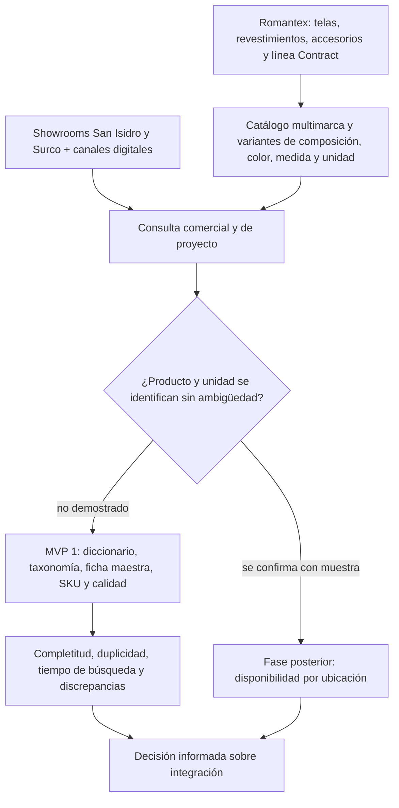

# Debate de informe — IRD-2 — v1-capitulo-1

## CONTEXTO

- dominio: retail de decoración y textiles de interior; importación, showroom y línea Contract
- pais_region: Perú, Lima
- fase_entregable: diagnóstico / capítulo 1
- draft revisado: `docs/v1-capitulo-1/draft.md` (solo lectura)
- modo: `make_report_polish`

## Anclas extraídas del draft

- Romantex S.A.C.; RUC 20293975036; sociedad anónima cerrada.
- Inicio de actividades registrado: 1 de octubre de 1995; establecimiento comunicado por la empresa: 1996.
- Sedes: avenida Paz Soldán 185, San Isidro, y avenida El Polo 376, Surco, Lima.
- Oferta: telas decorativas, revestimientos murales, pasamanería, cojines y accesorios; productos importados y marcas internacionales; línea Contract.
- Canales: showrooms, sitio web, solicitud de muestras, teléfono, correo y redes sociales.
- Referentes: Global Textile Scheme; Andover Fabrics; Acumatica Distribution; BigCommerce; Pittarello; OneStock; Shopify Plus.
- MVP 1: diccionario de datos, taxonomía textil, ficha maestra, propuesta de SKU y matriz de calidad y responsabilidades.

## Ronda 1 — hallazgos de fondo

### Crítico estricto

1. El draft cumple las reglas principales del capítulo 1: el sujeto del FODA es Romantex y su entorno, y el Lean Canvas principal describe la empresa. No obstante, las debilidades deben seguir formuladas como fricciones a diagnosticar, porque el AS-IS interno no está publicado.
2. La reseña tiene sustancia y conserva las fechas 1995/1996, sedes y oferta. El riesgo de genericidad aparece cuando se habla de digitalización sin anclarla a marcas internacionales, unidades de venta, showroom y línea Contract.
3. El benchmark debe conservar nombres propios: Global Textile Scheme, Andover Fabrics, Acumatica, BigCommerce, Pittarello, OneStock y Shopify Plus. Sustituirlos por “soluciones del mercado” reduciría el aporte.
4. La principal mejora necesaria es compresión: la misión, visión y valores pueden mantener sus matices sin repetir con la misma estructura la ausencia de declaraciones formales.
5. Puntuación: sujeto_foda 4/5; sujeto_lean 5/5; densidad_hechos 4/5; problema 4/5; alcance 5/5; evidencia_aporte 4/5.
6. Veredicto: **apto_con_cambios** antes del gate; no hay ataque fuerte que obligue a alterar el contenido.

### Defensor con fundamento

- La distinción entre la fecha registral de 1995 y la historia comercial de 1996 es una mejora de rigor, no una contradicción.
- El Lean principal sí modela segmentos, oferta, canales, costos e ingresos de Romantex; el “Encaje del proyecto” aparece después y no lo reemplaza.
- La conexión entre atributos y negocio está demostrada por la propia composición de la oferta: telas, revestimientos, accesorios, marcas internacionales, showrooms y línea Contract. El informe no afirma que exista un error interno medido; propone un diagnóstico.
- Las fuentes empresariales y los casos externos tienen funciones distintas: Romantex sustenta la presentación; Acumatica, OneStock y Global Textile Scheme contextualizan patrones sectoriales.
- Límite honesto: no hay datos públicos de ventas, márgenes, tiempos de consulta ni discrepancias de inventario. El reporte los presenta como métricas por obtener, no como resultados.

### Impacto social

- Beneficiarios directos: asesores, almacén, responsables de catálogo, diseñadores, compradores residenciales y responsables de proyectos Contract.
- El impacto del capítulo es organizativo y de servicio: clarifica dónde una ficha de producto puede afectar una consulta, una muestra o una cotización. No se presenta como impacto social amplio.
- Si el modelo se escala, podría reducir reprocesos y mejorar la claridad de la atención; esa consecuencia permanece como proyección, no como hecho.
- Riesgos reales: carga adicional para quien actualiza fichas, dependencia de una herramienta, acceso innecesario a datos comerciales y pérdida de particularidades del proveedor. El reporte conserva la necesidad de responsables y reglas de normalización.
- Puntuación de impacto: relevancia 4/5 para el capítulo y la fase actual.

### Viabilidad MVP

- El alcance es manejable porque el capítulo no implementa un sistema: presenta el contexto empresarial y conecta el diagnóstico con una muestra de dos o tres familias.
- El criterio de secuencia es la dependencia de datos: primero atributos y SKU; después disponibilidad por ubicación; finalmente indicadores de reposición.
- La mención del MVP queda breve y no invade el capítulo 1 con los artefactos completos.
- Puntuación: manejabilidad 5/5; claridad del MVP 5/5; ajuste a restricciones 5/5.

### Inversor

- Beneficiario económico: Romantex, especialmente sus equipos de asesoría y almacén; beneficiarios de adopción: clientes de proyectos que requieren respuestas precisas.
- Tesis de valor: ordenar el dato antes de integrar evita automatizar inconsistencias y permite decidir con evidencia si se justifica un piloto posterior.
- Métricas proxy: completitud, duplicidad, tiempo de búsqueda y discrepancias entre registro y muestra.
- No hay ROI demostrado ni datos públicos para calcularlo; el capítulo no inventa ahorro, margen ni crecimiento.
- Puntuación: retorno 3/5; camino de valor 4/5; credibilidad de beneficios 4/5. Veredicto: **GO_con_cambios** por falta de línea base económica, mitigada por la tesis de riesgo evitado.

## Ronda 2 — cruce

### Pregunta 1

**Crítico:** ¿El informe está describiendo fallas actuales de Romantex cuando no tiene acceso a sus sistemas?

**Defensor:** No. El texto usa “debilidades o fricciones a diagnosticar”, “puede” y “debe comprobarse”. Los hechos se limitan a la identidad, oferta, sedes y canales publicados; la desalineación entre fuentes es el objeto del diagnóstico, no un resultado ya observado.

**Resolución:** mantener la separación entre hechos públicos y diseño del proyecto en la presentación, FODA y puente al MVP.

### Pregunta 2

**Crítico:** ¿El Lean Canvas terminó describiendo el demo de ficha maestra en lugar del negocio?

**Defensor:** No. El lienzo principal presenta clientes, problemas, solución, canales, costos e ingresos de Romantex: diseñadores, compradores residenciales, proyectos comerciales, showrooms, productos importados y línea Contract. El MVP aparece solamente en “Encaje del proyecto” como contraste operativo.

**Resolución:** conservar esa estructura y evitar mover la tabla Lean del MVP al apartado empresarial.

### Pregunta 3

**Crítico:** ¿Qué evita que la sección de macroentorno se vuelva “existen soluciones”?

**Defensor:** El texto nombra Global Textile Scheme, Andover Fabrics, Acumatica Distribution, BigCommerce, Pittarello, OneStock y Shopify Plus, y explica qué patrón aporta cada referente. También aclara que no son recomendaciones automáticas para Romantex.

**Resolución:** conservar vendors y casos en el reporte y en las referencias.

### Pregunta 4

**Inversor:** ¿Qué valor puede defenderse sin inventar ROI?

**Defensor:** Una decisión de inversión mejor informada. El capítulo propone usar completitud, duplicidad, tiempo de búsqueda y discrepancia entre registro y muestra como señales para decidir si el piloto de disponibilidad merece recursos.

**Resolución:** presentar el beneficio como riesgo evitado y capacidad comercial habilitada, no como retorno financiero probado.

### Pregunta 5

**Impacto:** ¿La mejora de datos basta para hablar de impacto social?

**Viabilidad:** En esta versión no se exagera: el efecto actual es organizativo y de servicio. El alcance es acotado a la empresa y a sus usuarios comerciales; cualquier impacto ampliado se formula como proyección.

**Resolución:** mantener una lectura prudente del impacto y no agregar ODS o beneficios sociales no demostrados.

## Gate anti-genérico

- **Anclas conservadas:** sí. Se mantienen Romantex S.A.C., RUC 20293975036, 1995, 1996, avenida Paz Soldán 185, avenida El Polo 376, San Isidro, Surco, línea Contract, Global Textile Scheme, Andover Fabrics, Acumatica, BigCommerce, Pittarello, OneStock y Shopify Plus.
- **FODA sujeto empresa:** sí. Fortalezas y debilidades se refieren a oferta, sedes, catálogo, responsabilidades y coordinación entre canales; el puente separa los límites del MVP.
- **Lean sujeto empresa:** sí. El lienzo principal modela el negocio de Romantex; el MVP se presenta en un contraste posterior.
- **Reseña:** sí. Conserva cuatro párrafos con hitos, fechas, sedes y evolución de oferta.
- **Misión/visión/valores:** sí. No usa tres bloques idénticos; distingue ausencia de enunciados formales, narrativa institucional y traducción del proyecto.
- **Genéricos prohibidos:** no detectados.
- **Resultado:** gate aprobado.

## Ronda 3 — calidad

### Gramática y continuidad

- Diagnóstico: coherente, con algunas repeticiones controladas sobre “fuente común”, “atributos” y “asesoría”.
- Reescritura aplicada: se redujeron párrafos repetitivos sobre la ausencia de misión, visión y valores, manteniendo el matiz de que la empresa sí comunica una propuesta observable.
- Se acortaron tablas y se conservaron nombres propios, fechas, sedes y vendors.
- No quedaron labels de pipeline en el reporte.
- Veredicto de prosa: listo.

### Revisor científico

- Coherencia argumental: alta. La historia y la oferta conducen al diagnóstico; el diagnóstico conduce al MVP sin convertirlo en implementación.
- Draft vs reporte: mejorada; anclas y sustancia conservadas.
- Sujeto FODA/Lean: empresa_ok.
- Citas: alineadas con las seis entradas de referencias; no hay `TODO: citar` residual.
- Riesgo restante: costos, ingresos y métricas empresariales no tienen valores públicos; el texto los identifica como formulaciones prudentes o indicadores propuestos.
- Puntuación: sentido interno 5/5; rigor de citas 4/5; consistencia 5/5; densidad de hechos 4/5.
- Veredicto: apto.

## Veredicto de polish

**APTO con cambios de fondo ya incorporados:** el reporte es publicable como capítulo 1 del proyecto, siempre que no se interpreten las fricciones operativas como resultados medidos. El siguiente trabajo puede avanzar hacia el capítulo 2 o hacia la validación de campo del MVP 1.

## Tesis de valor

Ordenar el dato de producto antes de invertir en integración reduce el riesgo de automatizar inconsistencias y permite decidir, mediante métricas de calidad y búsqueda, si Romantex debe financiar una fase posterior de disponibilidad por ubicación.

## Diagrama del argumento

## Fuentes consultadas

- Romantex, empresa: https://www.romantex.com.pe/empresa
- Romantex, sitio y canales: https://www.romantex.com.pe/
- UniversidadPeru, ficha pública: https://www.universidadperu.com/empresas/romantex.php
- Global Textile Scheme, estándar de intercambio de datos textiles: https://www.globaltextilescheme.org/gts-standard/
- Acumatica, caso Andover Fabrics: https://www.acumatica.com/success-stories/andover-fabrics/
- OneStock, caso Pittarello: https://www.onestock-retail.com/customer-story/omnichannel-oms-for-fashion-retail-pittarello/
- Draft y artefactos MVP del proyecto IRD-2, consultados mediante Graphify.
