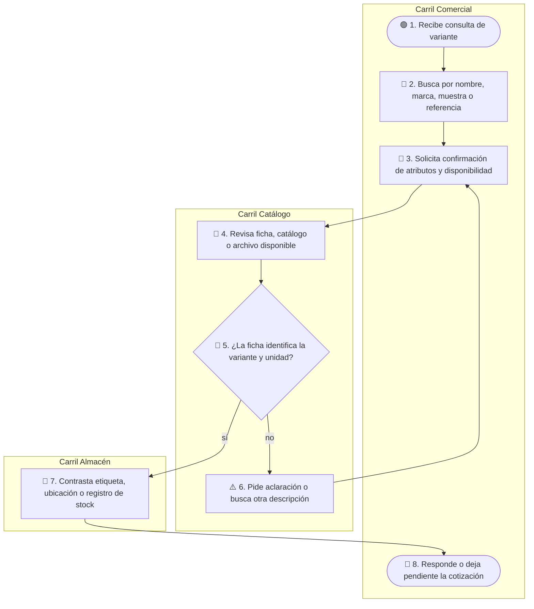
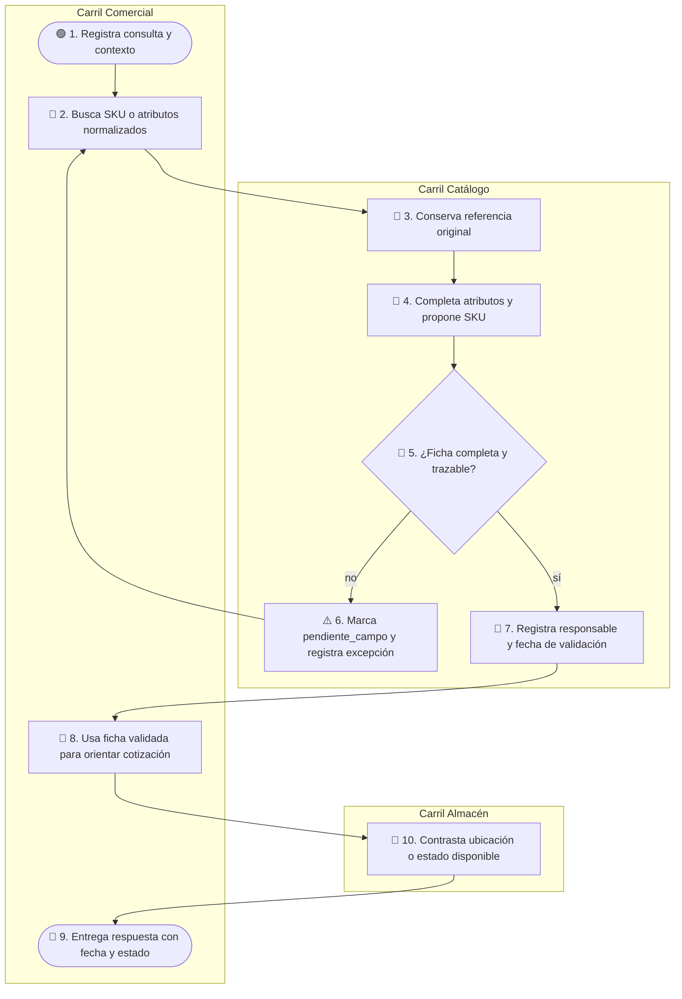

# AS-IS / TO-BE — MVP 1

## 1. AS-IS: consulta y descripción de una variante

**Estado global:** hipótesis / pendiente_campo. No se afirma que este sea el proceso real; representa el flujo mínimo que debe observarse para validar el diagnóstico.

### Glosario

- **Variante:** combinación concreta de producto y atributos como marca, composición, color, ancho y unidad de venta.
- **Unidad de venta:** forma en que se cotiza o entrega el producto, por ejemplo metro, rollo o unidad.
- **Ficha o archivo disponible:** fuente que el equipo usa actualmente; su formato y autoridad real quedan `pendiente_campo`.

### Paso a paso

1. **🟢 1. Recibe consulta de variante** — Carril Comercial. Llega una solicitud de un cliente residencial, diseñador o proyecto Contract. La consulta puede incluir nombre, marca, color, medida o aplicación. Siguiente: la flecha va a 🔵 2.
2. **🔵 2. Busca por nombre, marca, muestra o referencia** — Carril Comercial. El asesor intenta encontrar la variante usando la información que tiene disponible. Siguiente: la flecha va a 🔵 3.
3. **🔵 3. Solicita confirmación de atributos y disponibilidad** — Carril Comercial. El asesor formula la pregunta que necesita resolver; todavía no se declara stock. Cambio de carril → Catálogo, porque Comercial pasa la consulta al rol que puede revisar la fuente de producto.
4. **🔵 4. Revisa ficha, catálogo o archivo disponible** — Carril Catálogo. El responsable contrasta la descripción recibida con la fuente que tenga disponible. Siguiente: la flecha va a 🔶 5.
5. **🔶 5. ¿La ficha identifica la variante y unidad?** — Carril Catálogo. La decisión pregunta si la variante y su unidad de venta están suficientemente identificadas. Rama no → ⚠️ 6; rama sí → 🔵 7.
6. **⚠️ 6. Pide aclaración o busca otra descripción** — Carril Catálogo. La ambigüedad obliga a buscar un alias, preguntar de nuevo o revisar otra fuente. Cambio de carril → Comercial, porque la consulta vuelve al rol que debe precisar el pedido. La flecha retorna a 🔵 3.
7. **🔵 7. Contrasta etiqueta, ubicación o registro de stock** — Carril Almacén. Almacén revisa la evidencia disponible para confirmar la variante y su estado. Cambio de carril → Comercial, porque la respuesta vuelve a quien cotiza.
8. **🔴 8. Responde o deja pendiente la cotización** — Carril Comercial. El asesor comunica la disponibilidad o deja la respuesta pendiente si el contraste no fue concluyente. El flujo termina con una respuesta, una espera o una nueva consulta.

## 2. TO-BE: ficha maestra validable para la muestra

**Referencia:** DT Prototype + MVP 1. La disponibilidad real no se modifica; el flujo mejora la identificación y la trazabilidad de la ficha.

### Glosario

- **SKU:** identificador interno propuesto para recuperar una variante; no reemplaza la referencia original del proveedor.
- **Ficha completa y trazable:** ficha con atributos obligatorios, unidad, fuente, responsable, fecha y estado de validación.
- **Fecha y estado:** fecha de revisión y estado `validada`, `observada` o `pendiente_campo`; no equivalen por sí solos a stock en tiempo real.

### Paso a paso

1. **🟢 1. Registra consulta y contexto** — Carril Comercial. El asesor documenta la solicitud y los atributos conocidos, incluyendo aplicación o proyecto si corresponde. Siguiente: la flecha va a 🔵 2.
2. **🔵 2. Busca SKU o atributos normalizados** — Carril Comercial. Se usa el SKU propuesto o los atributos de la ficha para iniciar la búsqueda. Cambio de carril → Catálogo, porque el registro maestro debe conservar y normalizar la fuente.
3. **🔵 3. Conserva referencia original** — Carril Catálogo. Se copia la referencia del proveedor sin borrarla ni convertirla todavía en una equivalencia. Siguiente: la flecha va a 🔵 4.
4. **🔵 4. Completa atributos y propone SKU** — Carril Catálogo. Se completan familia, composición, color, ancho, unidad de venta y demás campos de la muestra, y se propone el identificador interno. Siguiente: la flecha va a 🔶 5.
5. **🔶 5. ¿Ficha completa y trazable?** — Carril Catálogo. Se revisa si la ficha tiene atributos obligatorios, fuente, unidad, responsable, fecha y estado. Rama no → ⚠️ 6; rama sí → 🔵 7.
6. **⚠️ 6. Marca pendiente_campo y registra excepción** — Carril Catálogo. El dato faltante no se inventa; queda visible para pedir evidencia o corregir la ficha. La flecha retorna a 🔵 2 para que la búsqueda no trate la ficha incompleta como válida.
7. **🔵 7. Registra responsable y fecha de validación** — Carril Catálogo. Una contraparte interna deja constancia de quién revisó la ficha y cuándo. Siguiente: la flecha va a 🔵 8.
8. **🔵 8. Usa ficha validada para orientar cotización** — Carril Comercial. El asesor usa la ficha como fuente común de atributos; todavía debe contrastar la disponibilidad cuando corresponda. Cambio de carril → Almacén, porque el estado físico o la ubicación requieren contraste del rol de almacén.
9. **🔴 9. Entrega respuesta con fecha y estado** — Carril Comercial. El asesor comunica la respuesta junto con la fecha y el estado de la información, evitando presentar un dato no verificado como tiempo real. El flujo termina con una cotización informada.
10. **🔵 10. Contrasta ubicación o estado disponible** — Carril Almacén. Almacén revisa la evidencia disponible para el dato de ubicación o estado y devuelve el resultado al flujo comercial. En el diagrama, esta comprobación precede al cierre 🔴 9 aunque el nodo aparezca después por mantener la numeración del cierre; el cierre recibe la respuesta de este contraste.

## 3. Brecha AS-IS → TO-BE

- Se pasa de buscar una descripción en fuentes no confirmadas a conservar el origen y registrar una normalización explícita; `valida: R1`.
- Se pasa de una identificación dependiente de memoria o alias a una propuesta de SKU y atributos obligatorios; `valida: R2`.
- Se incorpora responsable, fecha y estado de validación, sin afirmar que la ficha implique stock en tiempo real; `valida: R3`.
- Se mantiene el contraste físico o documental antes de declarar disponibilidad y se difiere la integración multicanal; `valida: R4`.
