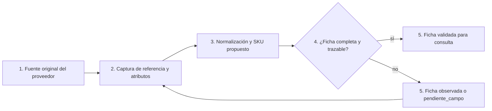

# Lean Canvas — MVP 1

## Lienzo

### Tabla 1 — fila superior

| PROBLEMA                                                                                                                                                                                                                                                                                                                                                                                                        | SOLUCIÓN                                                                                                                                                                                                          | PROPUESTA DE VALOR ÚNICA                                                                                                                                                                                                                                                                          | VENTAJA ESPECIAL                                                                                                                                                                                                                                                    | SEGMENTO DE CLIENTES                                                                                                                                                                                                                                                                                     |
| --------------------------------------------------------------------------------------------------------------------------------------------------------------------------------------------------------------------------------------------------------------------------------------------------------------------------------------------------------------------------------------------------------------- | ----------------------------------------------------------------------------------------------------------------------------------------------------------------------------------------------------------------- | ------------------------------------------------------------------------------------------------------------------------------------------------------------------------------------------------------------------------------------------------------------------------------------------------- | ------------------------------------------------------------------------------------------------------------------------------------------------------------------------------------------------------------------------------------------------------------------- | -------------------------------------------------------------------------------------------------------------------------------------------------------------------------------------------------------------------------------------------------------------------------------------------------------- |
| - Atributos de producto heterogéneos entre marcas y fuentes (`hipótesis`). - Consultas de variante, unidad y disponibilidad que pueden requerir reproceso (`hipótesis`). - Datos incompletos o duplicados que dificultan reposición y análisis (`pendiente_campo`).  Alternativas existentes: catálogo del proveedor, registros actuales, consulta manual y archivos separados (`pendiente_campo`). | - Diccionario de datos y taxonomía para 2–3 familias. - Ficha maestra que conserva origen, normalización, unidad, ubicación y estado. - Propuesta de SKU y matriz de calidad con responsable (`hipótesis`). | Para equipos comerciales y de almacén que necesitan identificar variantes textiles sin ambigüedad, el modelo maestro piloto es un sistema de datos de producto que permite validar atributos y unidad de venta antes de cotizar, a diferencia de consultar descripciones dispersas (`hipótesis`). | Conocimiento contextual de un catálogo textil multimarca y reglas de normalización que conservan el valor original junto con la interpretación interna (`hipótesis`). Aún no es una ventaja difícil de copiar hasta validar adopción y calidad (`pendiente_campo`). | - Asesores de showroom y equipo comercial Contract (`evidencia` de líneas y canales públicos; rutina interna `pendiente_campo`). - Almacén y responsable de catálogo (`pendiente_campo`). - Early adopters: quienes atienden consultas de 2–3 familias priorizadas y validan fichas (`hipótesis`). |

### Tabla 2 — fila media

| MÉTRICAS CLAVE                                                                                                                                                                                                                                                                                                       | CANALES                                                                                                                                                                                                                                                                                                        |
| -------------------------------------------------------------------------------------------------------------------------------------------------------------------------------------------------------------------------------------------------------------------------------------------------------------------- | -------------------------------------------------------------------------------------------------------------------------------------------------------------------------------------------------------------------------------------------------------------------------------------------------------------- |
| - Completitud de atributos obligatorios por registro. - Variantes sin duplicidad en la muestra. - Tiempo de búsqueda o respuesta antes/después del prototipo. - Discrepancias entre muestra física y registro. - Porcentaje de fichas con responsable, fecha y estado de validación (`pendiente_campo`). | Internos: sesión de observación con comercial y almacén, muestra de fichas, registro compartido y revisión con responsable (`pendiente_campo`).  El canal web y los showrooms son contexto del problema, no una integración incluida en este MVP (`evidencia` pública; flujo interno `pendiente_campo`). |

### Tabla 3 — base del lienzo

| ESTRUCTURA DE COSTOS                                                                                                                                                                                                                                                               | FLUJO DE INGRESOS                                                                                                                                                                                                                              |
| ---------------------------------------------------------------------------------------------------------------------------------------------------------------------------------------------------------------------------------------------------------------------------------- | ---------------------------------------------------------------------------------------------------------------------------------------------------------------------------------------------------------------------------------------------- |
| - Tiempo del equipo para observar, limpiar y validar la muestra. - Reuniones con comercial, almacén y catálogo. - Herramienta de registro disponible y capacitación inicial. - Costo futuro de migración o integración, solo como riesgo a estimar después (`hipótesis`). | No hay cobro ni producto comercial en el MVP académico (`N/A`).  Valor esperado a validar: menor tiempo de búsqueda, menor riesgo de cotizar con atributos ambiguos y mejor base para decidir un piloto de disponibilidad (`hipótesis`). |

## Feature central: ficha maestra validable

1. **Fuente original del proveedor:** se conserva el nombre o referencia recibida; todavía no se modifica el registro.
2. **Captura de referencia y atributos:** se recopilan familia, marca, composición, color, ancho, unidad de venta y demás campos obligatorios; los campos ausentes quedan explícitos.
3. **Normalización y SKU propuesto:** se aplica una regla documentada y se propone el identificador interno sin borrar la referencia original.
4. **¿Ficha completa y trazable?:** se verifica si existen atributos obligatorios, unidad, fuente, responsable y fecha. Es una decisión; no equivale a declarar stock disponible.
5. **Ficha validada para consulta:** comercial y almacén pueden usar el registro como referencia del MVP. Si la respuesta es negativa, la ficha vuelve a captura para completar datos o queda marcada como `pendiente_campo`.
