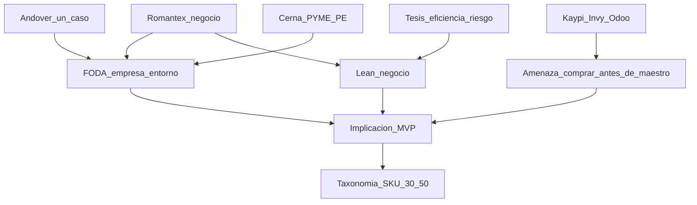

# Debate de informe — ITD — v1-capitulo-1

## Puntuación

| Eje | Critico | Defensa | Impacto | Viabilidad | Inversor | Gramática | Revisor | Notas |
|-----|---------|---------|---------|------------|----------|-----------|---------|-------|
| sujeto_foda | 4 | 4 | — | — | — | — | 5 | Empresa/entorno; PoC solo en implicación |
| sujeto_lean | 5 | 4 | — | 5 | 4 | — | 5 | Lienzo Romantex + contraste MVP |
| densida_hechos | 3→4 | 3 | — | — | — | — | 4 | RUC restaurado en reporte |
| evidencia / citas | 3 | 3 | 3 | 4 | 3 | — | 4 | Andover=1 caso; Ghosh adyacente |
| impacto / valor | — | — | baja (Cap.1) | — | 4 camino | — | — | Tesis eficiencia/riesgo, sin ROI $ |
| prosa | — | — | — | — | — | listo | — | 5 micro-ajustes aplicados |
| **Veredicto** | GO_con_cambios | apto | recortar retórica | no inflar | GO_con_cambios | listo | **apto** | Polish OK |

## Ataques fuertes del crítico (resumen)

1. RUC omitido en el draft pese a citar UniversidadPeru.
2. M/V/V en tres bloques gemelos (forma de plantilla).
3. Andover citado vía Acumatica + BigCommerce como si fueran dos casos.
4. Ghosh (calzado) usado con peso de ancla sectorial deco.
5. “Escala PYME facilita piloto” dentro de fortalezas empresariales.

## Tesis de valor (inversor)

Estandarizar atributos y un SKU piloto convierte el activo ya vendible (stock, catálogo y Contract) en dato confiable que acelera cotizaciones y reduce promesas inconsistentes, sin inventar un nuevo modelo de ingresos.

## Preguntas y respuestas (cronológico)

1. **Q (crítico):** ¿Por qué el RUC no aparece en 1.1 si UniversidadPeru es fuente primaria?  
   **A (defensor / orquestador):** Concedido. En el reporte se escribe RUC 20293975036 en la presentación.

2. **Q (crítico):** Si M/V/V no existen, ¿por qué tres casillas paralelas?  
   **A:** Se mantienen los headings del modelo (estructura del draft) pero se acorta prosa y se evita el estribillo “el PoC…”; misión/visión/valores quedan como reconstrucción explícitamente no formal.

3. **Q (crítico):** ¿Cómo defender Acumatica y BigCommerce como oportunidades distintas?  
   **A:** No. El reporte etiqueta Andover como un solo referente (dos URLs del mismo despliegue).

4. **Q (inversor):** ¿Cabe ROI monetario en Cap.1?  
   **A (viabilidad + impacto):** No. Solo tesis de eficiencia/riesgo y proxies falsables; soft-veto si se inflan dólares.

5. **Q (impacto):** ¿Hay que “humanizar” el Cap.1 con ODS/empleo?  
   **A:** No. Impacto social bajo y local; a lo sumo adopción laboral de asesores (~17), sin retórica inclusiva.

## Cruce R2 / propuestas de valor

- Conservar FODA/Lean empresa (consenso crítico + defensor).
- Correcciones en reporte: RUC; Andover=1 caso; Ghosh=adyacente; PYME→implicación MVP; tesis de valor; tono Božić ≠ medición Romantex.
- Recortar densidad de vendors (viabilidad): se mantiene lista pero sin RFP.
- Soft-veto inversor: no aplicado (no hay ROI inventado).

## Gate anti-genérico

- anclas_conservadas: **sí** — Romantex, RUC 20293975036, Paz Soldán / El Polo, 1995/1996, Balmaceda, ~17, Contract, metro/rollo, 30–50 refs, Andover, Cerna, Kaypi, Invy, Odoo, Božić, Spruit, Ghosh, GTS, Pittarello/OneStock
- foda_sujeto_empresa: **sí**
- lean_sujeto_empresa: **sí**
- genéricos sin nombres: **no** (falló gate en borrador intermedio corregido)

## Calidad R3

- [gramatica-continuidad] Prosa coherente; 5 micro-reescrituras aplicadas (visión, locales, Contract, apertura fortalezas, conector Božić).
- [revisor-cientifico] **apto** — sustancia reforzada vs draft; citas alineadas; sin TODOs.

## Diagrama

## Fuentes consultadas

- Draft y reporte `docs/v1-capitulo-1/`
- `company.md`, profile, theme-audit (benchmark)
- Bib-auto: Božić 2024, Ghosh 2026, Spruit 2015
- UniversidadPeru / Romantex / Ellas Internacional
