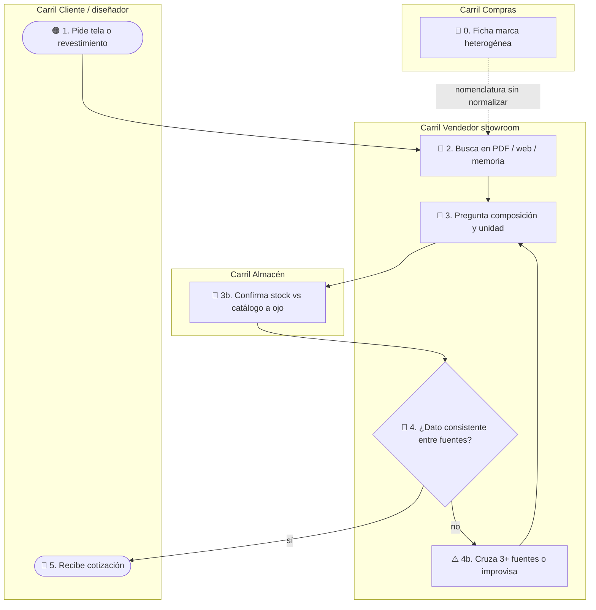
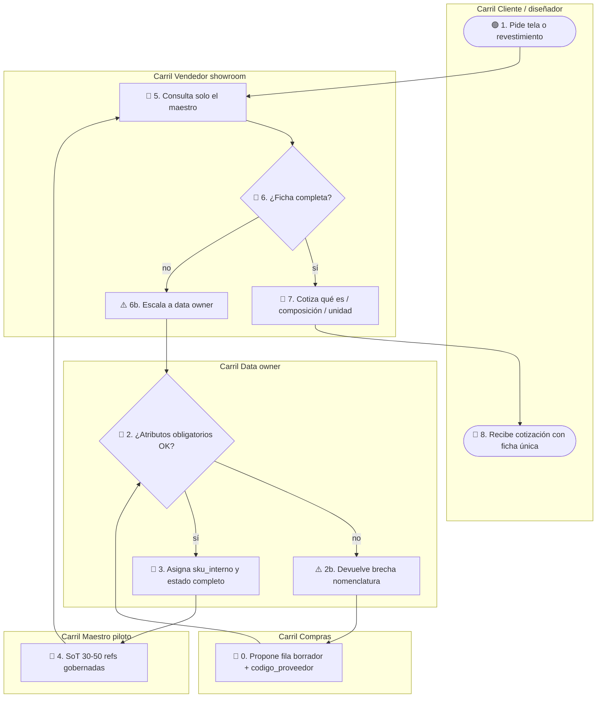

# AS-IS / TO-BE — MVP 1: Taxonomía textil + SKU piloto

**Proyecto:** ITD · Romantex S.A.C.  
**Flujo crítico:** consulta de ficha de producto (qué es / composición / unidad / stock vs catálogo) en cotización showroom.  
**Etiqueta global AS-IS:** `hipótesis` (sin observación de campo cerrada) — `confiabilidad: baja hasta Fase 0`.  
**TO-BE:** `ref: DT Prototype` (`ROMANTEX_MVP1_Maestro_Producto_Piloto`).

---

## AS-IS

### Leyenda

| Emoji | Significado |
|-------|-------------|
| 🟢 | Inicio |
| 🔵 | Actividad |
| 🔶 | Decisión |
| 🔴 | Fin |
| ⚠️ | Fricción |

### Glosario

- **Fuente:** cualquier artefacto usado para responder (PDF marca, Excel, OpenCart/web, muestra física, chat interno).
- **Stock vs catálogo:** disponibilidad inmediata en almacén/showroom frente a pedido a proveedor bajo catálogo.

### Paso a paso (AS-IS)

1. **🔵 0. Ficha marca heterogénea** — Carril Compras. Llegan códigos y prosa de composición distintos por marca; no hay `sku_interno` común. `hipótesis`
2. **🟢 1. Pide tela o revestimiento** — Carril Cliente / diseñador. Solicita referencia, color, metros o uso Contract.
3. **Cambio de carril → Vendedor showroom.** El pedido entra al asesor.
4. **🔵 2. Busca en PDF / web / memoria** — Carril Vendedor. Abre una o más fuentes no unificadas. `hipótesis`
5. **🔵 3. Pregunta composición y unidad** — Carril Vendedor. Formula qué es, fibra, metro/rollo.
6. **Cambio de carril → Almacén.** Pasa la duda de disponibilidad.
7. **🔵 3b. Confirma stock vs catálogo a ojo** — Carril Almacén. Responde con identificador informal (nombre comercial / código marca). `hipótesis`
8. **Cambio de carril → Vendedor.** Vuelve la respuesta.
9. **🔶 4. ¿Dato consistente entre fuentes?** — Carril Vendedor. Compara PDF, almacén y (a veces) web.
   - **Rama sí →** 🔴 5.
   - **Rama no →** ⚠️ 4b.
10. **⚠️ 4b. Cruza 3+ fuentes o improvisa** — Carril Vendedor. Fricción central del MVP 1. `hipótesis` · `valida: R1`
11. Vuelve a **🔵 3** hasta cerrar o cotizar con riesgo.
12. **🔴 5. Recibe cotización** — Carril Cliente. Cierra con dato que puede no ser reproducible.

---

## TO-BE (solo MVP 1)

### Paso a paso (TO-BE)

**Pista A — Alta gobernada (antes o en paralelo a la venta)**

1. **🔵 0. Propone fila borrador + codigo_proveedor** — Carril Compras. Carga campos crudos desde ficha de marca.
2. **Cambio de carril → Data owner.**
3. **🔶 2. ¿Atributos obligatorios OK?** — Carril Data owner.
   - **no →** ⚠️ 2b → vuelve a 🔵 0 (`valida: R2`, `R4`, `R5`).
   - **sí →** 🔵 3.
4. **⚠️ 2b. Devuelve brecha nomenclatura** — Carril Data owner. Registra gap proveedor vs taxonomía Romantex.
5. **🔵 3. Asigna sku_interno y estado completo** — Carril Data owner. Emite `RX-…` y publica.
6. **Cambio de carril → Maestro piloto.**
7. **🔵 4. SoT 30-50 refs gobernadas** — Carril Maestro. Única fuente autorizada del piloto. `ref: DT Prototype`

**Pista B — Cotización (se junta en el maestro)**

8. **🟢 1. Pide tela o revestimiento** — Carril Cliente.
9. **Cambio de carril → Vendedor.**
10. **🔵 5. Consulta solo el maestro** — Carril Vendedor. Primera fuente = ficha `sku_interno`. `valida: R3`
11. **🔶 6. ¿Ficha completa?**
    - **sí →** 🔵 7.
    - **no →** ⚠️ 6b → regresa a gate data owner (🔶 2).
12. **⚠️ 6b. Escala a data owner** — no se cotiza con prosa libre.
13. **🔵 7. Cotiza qué es / composición / unidad** — Carril Vendedor. Sin cruzar PDF + web + chat como SoT.
14. **🔴 8. Recibe cotización con ficha única** — Carril Cliente.

**Fuera de TO-BE MVP 1:** tablero multisede (MVP 2), sync web (MVP 3), ERP/WMS.

---

## Brecha AS-IS → TO-BE

- **Qué cambia:** aparece gate de data owner + `sku_interno`; el vendedor consulta un maestro en lugar de N fuentes; composición pasa a estructura controlada.
- **Qué se deja igual:** venta consultiva en showroom; distinción stock vs catálogo como atributo (aún sin sync multisede); sin ERP nuevo.
- **Qué se valida en campo:** `valida: R1` (dolor ≥3 fuentes), `valida: R2` (ownership), `valida: R3` (adopción), `valida: R4` (SKU), `valida: R5` (≥90 % completitud).
- **Confiabilidad:** TO-BE conceptual hasta Fase 0; no afirmar operación actual de Romantex como auditada.
