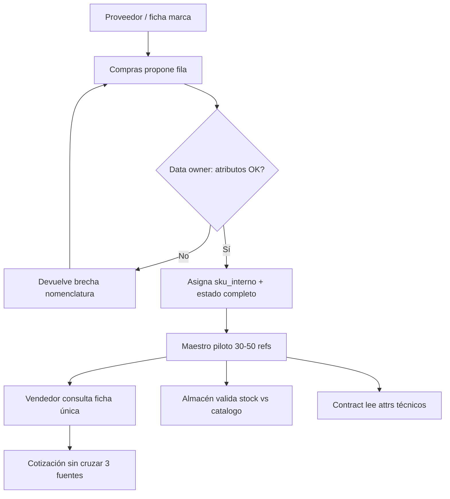

# Design Thinking — MVP 1: Taxonomía textil + SKU piloto

**Proyecto:** ITD · Romantex S.A.C.  
**Objetivo MVP:** Fuente única de producto (taxonomía + SKU piloto)  
**Alcance de este archivo:** Empatizar → Definir → Idear → Prototipar (Test post-RAT)

---

## 1. Empatizar

### 1.1 Roles (máx. 5)

| # | Rol | Relación con el dato de producto | Etiqueta |
|---|-----|----------------------------------|----------|
| 1 | **Vendedor / asesor de showroom** (San Isidro o Surco) | Consulta “qué es”, composición, unidad (metro/rollo) y si es stock o pedido por catálogo al cotizar | `hipótesis` — rol comercial inferido del modelo showroom + venta consultiva |
| 2 | **Responsable de almacén / inventario** | Registra y confirma metros disponibles; traduce códigos de marca a ubicación física | `hipótesis` — operación almacén central + stock declarado públicamente |
| 3 | **Compras / importaciones** | Incorpora fichas y nomenclaturas de marcas internacionales; decide qué entra a stock vs catálogo | `hipótesis` — importador registrado + pedidos por catálogo |
| 4 | **Asesor Contract / proyectos** | Exige atributos técnicos (aplicación, ignífugo, continuidad de lote) además del lenguaje comercial | `evidencia` — línea Contract publicada en romantex.com.pe/empresa |
| 5 | **Data owner de producto (designado en el piloto)** | Gobierna taxonomía, completa atributos obligatorios y autoriza altas/cambios del maestro piloto | `pendiente_campo` — rol a designar; no hay evidencia pública de dueño formal del dato |

### 1.2 Mapa de empatía (Dice / Piensa / Hace / Siente)

Sujeto focal del MVP: **vendedor/asesor de showroom** (con eco en almacén y Contract). Todo lo no contrastado en campo queda como hipótesis.

| Cuadrante | Contenido aplicado | Etiqueta |
|-----------|-------------------|----------|
| **Dice** | “¿Esta tela es la misma que la del PDF de la marca?”; “¿Se vende por metro o por rollo?”; “¿Tenemos metros o es pedido?”; al cliente Contract: “¿Cumple ignífugo / uso hospitalidad?” | `hipótesis` |
| **Piensa** | Que el código del proveedor, el nombre en vitrina y lo publicado en web deberían coincidir, pero no confía en una sola fuente; teme cotizar composición o ancho incorrectos | `hipótesis` |
| **Hace** | Cruza catálogo PDF / fichas de marca, registro de inventario, muestras físicas y (a veces) ficha web; anota a mano o en chat interno atributos para armar la cotización | `hipótesis` — patrón de “fuentes dispersas” del problema del profile; **no** es AS-IS interno auditado |
| **Siente** | Frustración y riesgo reputacional cuando el cliente (diseñador o hotel) detecta divergencia entre lo prometido y lo facturable; urgencia en turnos de showroom | `hipótesis` |

**Contexto externo (no hechos Romantex):** en PIM fashion/textil la jerarquía style → colorway → SKU y la composición como estructura (no free-text), más atributos técnicos (fibra, ancho, aplicación), son práctica de referencia para evitar ambigüedad entre canales (`evidencia` sectorial — LynkPIM 2026; guías PIM textiles). Distribuidores multimarca suelen reconciliar taxonomías de N proveedores en un maestro propio (`evidencia` sectorial — patrones tipo Pixee PIM). Adaptación deco metro/rollo: la “variante comprable” no es talla de confección sino **colorway + presentación (metro/rollo) + ancho** (`hipótesis` de diseño para Romantex).

### 1.3 Plan de observación — Fase 0

Sin entrevistas inventadas ni citas. Objetivo: convertir hipótesis del mapa en `evidencia` o `pendiente_campo` cerrado.

| # | Observación / shadowing | Quién | Qué registrar | Duración sugerida |
|---|-------------------------|-------|---------------|-------------------|
| O1 | Cotización real en showroom (residencial o diseñador) | Vendedor | Fuentes abiertas en pantalla/papel; orden de consulta; atributos pedidos por el cliente; si cruzó ≥3 fuentes | 2–3 turnos / sede |
| O2 | Confirmación stock vs pedido por catálogo | Vendedor + almacén | Tiempo hasta respuesta; identificador usado (código marca, nombre comercial, ubicación); fallos de match | 1 jornada coordinada |
| O3 | Alta o actualización de una referencia nueva de marca | Compras | Campos que llegan del proveedor; qué se reescribe a mano; dónde se guarda el “oficial” | 1 caso de importación reciente |
| O4 | Consulta Contract (ficha técnica) | Asesor Contract | Atributos técnicos exigidos vs disponibles en el registro comercial | 1 consulta o mock con brief real anonimizado |
| O5 | Inventario de fuentes de dato producto | Data owner (interim) | Lista de sistemas/archivos (ERP/sheets/PDF/web/OpenCart u otros) y campos solapados | Workshop 90 min |

**Preguntas abiertas en el momento (no “¿te gusta digitalizar?”):**  
- “Cuéntame la última vez que no pudiste confirmar composición o unidad en la misma visita.”  
- “¿Qué abriste primero y qué después?”  
- “¿Qué dato te faltó y dónde lo buscaste?”

**Criterio de cierre Fase 0:** ≥5 episodios observados (O1–O2) + mapa de fuentes (O5) documentado. Todo lo no visto permanece `pendiente_campo`.

---

## 2. Definir

### 2.1 Point of View (una frase)

**POV:** El asesor de showroom de Romantex necesita una **única ficha maestra** por referencia (qué es, composición estructurada, unidad de venta y si es stock o catálogo) porque hoy el catálogo multimarca y el inventario/web no comparten lenguaje de producto, y eso genera cotizaciones inconsistentes y demoras al confirmar disponibilidad.  
Etiqueta del problema nuclear: `hipótesis` (verificable en Fase 0); magnitud del dolor: `pendiente_campo`.

### 2.2 How Might We

| ID | HMW | Alineación MVP 1 | Etiqueta |
|----|-----|------------------|----------|
| **HMW-1 (primario)** | ¿Cómo podríamos **estandarizar una taxonomía deco mínima y un SKU interno** para que el **vendedor** responda qué es, composición y unidad de venta **sin cruzar tres fuentes**? | Directa: taxonomía + SKU + piloto 30–50 + criterio ≥90 % atributos | `hipótesis` de solución acotada |
| HMW-2 | ¿Cómo podríamos **mapear brechas de nomenclatura de proveedores** hacia el maestro para que **compras** incorpore refs nuevas sin reinventar nombres? | Matriz brechas + data owner | `hipótesis` |
| HMW-3 | ¿Cómo podríamos **definir atributos obligatorios Contract** (aplicación, ignífugo, continuidad) en la misma ficha para que el **asesor de proyectos** no mantenga un Excel paralelo? | Taxonomía + modelo datos TO-BE | `hipótesis` |
| HMW-4 | ¿Cómo podríamos **gobernar altas/cambios del piloto** (30–50 refs) para que un **data owner** mantenga ≥90 % de completitud de atributos obligatorios? | Gobernanza + criterio de éxito | `hipótesis` |

**Primario del MVP 1:** **HMW-1**. HMW-2–4 son habilitadores del mismo entregable; no abren MVP 2 (visibilidad multisede) ni sync web (MVP 3).

---

## 3. Idear

### 3.1 Ideas (3–5)

| ID | Idea | Encaje criterio éxito / esfuerzo / datos | Etiqueta |
|----|------|------------------------------------------|----------|
| I1 | **Maestro ligero en Sheets/Airtable** (taxonomía fija + SKU interno + atributos obligatorios + mapeo código proveedor) con data owner y piloto 30–50 refs | Alto valor / bajo esfuerzo / datos bajo control del equipo | `hipótesis` |
| I2 | **Plantilla de ficha única impresa + QR** a PDF por ref (sin sistema) | Bajo esfuerzo inicial / no escala ni mide ≥90 % completitud con facilidad | `hipótesis` |
| I3 | **PIM cloud commodity** (Odoo PIM / Lynk-like) configurado style→colorway→SKU desde día 1 | Alto esfuerzo / riesgo MVP+1; falta evidencia de stack actual | `pendiente_campo` stack AS-IS |
| I4 | **Wiki interna de nomenclatura** (solo glosario, sin SKU ni obligatoriedad de campos) | Bajo esfuerzo / no cumple “fuente única” ni unidad de venta gobernada | `hipótesis` |
| I5 | **SKU = código de la marca líder sin convención interna**; solo “lista blanca” de refs | Bajo esfuerzo / no resuelve N taxonomías de proveedores | `hipótesis` |

### 3.2 Descartes

| Idea | Motivo de descarte (alcance MVP 1 / profile) |
|------|-----------------------------------------------|
| I2 | No entrega modelo de datos TO-BE ni medición de completitud del piloto |
| I3 | ERP/PIM enterprise o implementación pesada = fuera de secuencia; amplifica inconsistencias si no hay taxonomía acordada primero |
| I4 | Glosario sin maestro SKU no permite al vendedor una sola fuente transaccional |
| I5 | Contrario al entregable “convención SKU interna” y a reconciliar N proveedores |

### 3.3 Priorizada

**I1 — Maestro ligero gobernado (Sheets o Airtable)** como prototipo ≤1 día y vehículo del piloto 30–50 refs.  
Justificación: maximiza probabilidad del criterio (≥90 % atributos obligatorios; respuesta sin 3 fuentes) con esfuerzo acotado y sin presuponer ERP. Sectorialmente alinea composición estructurada y jerarquía estilo/colorway/presentación (`evidencia` sectorial adaptada; `hipótesis` de adopción en Romantex).

---

## 4. Prototipar

### 4.1 Artefacto concreto (≤1 día de diseño)

**Nombre:** `ROMANTEX_MVP1_Maestro_Producto_Piloto`  
**Soporte:** Google Sheets o Airtable (una base / un libro).  
**Propósito:** única fuente consultable del piloto para qué es / composición / unidad / stock vs catálogo.

#### Columnas del maestro (mínimo)

| Columna | Obligatorio piloto | Notas |
|---------|-------------------|--------|
| `sku_interno` | Sí | Convención propia (ver abajo) |
| `codigo_proveedor` | Sí | Tal cual marca; clave de matriz de brechas |
| `marca` | Sí | |
| `nombre_comercial_romantex` | Sí | Lenguaje showroom |
| `familia` | Sí | Tapicería / Cortinas / Mural / Contract / Accesorio (taxonomía deco mínima) |
| `aplicacion` | Sí | Residencial / Contract / Ambos |
| `composicion_fibra` | Sí | Estructura: p. ej. `Lino 55 \| Algodón 45` (no prosa libre) |
| `ancho_cm` | Sí | |
| `unidad_venta` | Sí | `metro` \| `rollo` |
| `metros_por_rollo` | Condicional | Si unidad = rollo |
| `origen_disponibilidad` | Sí | `stock` \| `catalogo` \| `ambos` |
| `ignifugo` | Condicional Contract | Sí/No/ND |
| `estado_ficha` | Sí | `borrador` \| `completo` \| `obsoleto` |
| `owner_ultima_edicion` | Sí | |
| `fecha_actualizacion` | Sí | |
| `fuente_origen` | No | PDF marca / email / web / otro — trazabilidad |

**Taxonomía deco mínima (valores controlados):** `familia`, `aplicacion`, `unidad_venta`, `origen_disponibilidad`, `estado_ficha`.  
**Convención SKU interna (propuesta de prototipo):**  
`RX-{FAM}-{MARCA3}-{SEQ4}`  
Ej.: `RX-TAP-HAR-0042` (familia 3 letras, marca 3, secuencia 4).  
Etiqueta: `hipótesis` — validar con compras/ventas en Fase 0 (`pendiente_campo` si choque con códigos ya usados).

**Maestro mínimo:** **30–50 referencias** gobernadas (priorizar 2–3 familias del alcance: tapicería/cortinas, murales, Contract).  
**Completitud:** ítem “completo” = todos los obligatorios + condicionales aplicables llenos → objetivo ≥90 % del piloto (`criterio_exito` profile).

#### Roles y frecuencia

| Rol | Acción en el prototipo | Frecuencia |
|-----|------------------------|------------|
| Data owner | Alta/edición autorizada; rechazo de fichas incompletas; reporte % completitud | Diario en carga inicial; luego 2× semana |
| Vendedor | Solo lectura (o vista filtrada); consulta en cotización | En cada consulta del piloto |
| Compras | Propone filas nuevas + `codigo_proveedor`; no publica sin owner | Por embarque / alta de marca |
| Almacén | Valida `origen_disponibilidad` y unidad vs físico (sin abrir MVP 2 de multisede) | Semanal muestra del piloto |
| Contract | Completa `ignifugo` / `aplicacion` en refs Contract | Al incluir ref en piloto |

### 4.2 Diagrama del prototipo

### 4.3 Lectura nodo a nodo

| Nodo | Qué ocurre | Siguiente |
|------|------------|-----------|
| **A** | Entra dato heterogéneo del proveedor (PDF, código propio, prosa de composición) | **B** |
| **B** | Compras crea/actualiza borrador con `codigo_proveedor` y campos crudos | **C** |
| **C** | Data owner valida obligatorios y normaliza composición/familia/unidad | **D** si falla; **E** si pasa |
| **D** | Se registra brecha (proveedor vs taxonomía Romantex) y se corrige el borrador | Vuelve a **B** |
| **E** | Se emite `sku_interno` y `estado_ficha = completo` | **F** |
| **F** | Hoja/base maestra = SoT del piloto | Alimenta **G**, **H**, **I** |
| **G** | Vendedor lee qué es / composición / unidad desde **F** | **J** |
| **H** | Almacén confirma coherencia de `origen_disponibilidad` (muestra) | Feedback a owner si diverge (`pendiente_campo` cuantificar) |
| **I** | Contract usa mismos attrs; evita Excel paralelo en el piloto | — |
| **J** | Resultado buscado del HMW-1 / criterio de éxito cualitativo | Medición formal en Test post-RAT |

**Fuera de este prototipo:** sync automático a romantex.com.pe, tablero multisede, ERP/WMS (`evidencia` de exclusión en profile).

---

## 5. Evaluar (Test) — post-RAT

Mapa `R# → actividad` (umbrales = SoT en `rat.md`; no se modifican aquí).

| R# | Actividad de prueba | Protocolo (usuario usa, observador calla) | Umbral (ref RAT) |
|----|---------------------|---------------------------------------------|------------------|
| R1 | Contar fuentes por cotización | Shadowing sin guiar; checklist de fuentes abiertas | ≥8 cotiz.; si &lt;40 % cruzan ≥3 fuentes → R1 falsado |
| R2 | Gate de ownership | Pedir acta de nombramiento + observar 1 rechazo de ficha incompleta | Sin owner o sin gate en 14 días → R2 falsado |
| R3 | Adopción en cotización piloto | Tras ≥20 refs “completo”, observar 1.ª fuente abierta | &lt;70 % usa maestro primero en ≥10 cotiz. → R3 falsado |
| R4 | Convención SKU | Workshop compras + vendedor con 20 refs | ≥30 % conflicto irresoluble → R4 falsado |
| R5 | Completitud piloto | Carga 30 refs; % en “completo” | &lt;90 % en ≤15 días hábiles → R5 falsado |

**Criterio de éxito profile (operacionalizado):** ≥90 % ítems piloto con atributos obligatorios = **R5**; “vendedor responde sin cruzar 3 fuentes” = **R1** (baseline) + **R3** (adopción).

**Hallazgo si hay que explicar el prototipo:** si el vendedor no encuentra la ficha sin inducción, registrar como fricción de UX del maestro (`pendiente_campo` iteración futura) — **no** reabrir Empathize en este run.

**Si Test pide reabrir Empathize:** declarar `pendiente_campo` / pregunta al equipo; no re-ejecutar el pipeline aquí.

---

## 6. Preguntas al equipo

1. En turnos recientes de showroom, ¿cuántas cotizaciones exigieron cruzar ≥3 fuentes para composición o unidad — y en qué sede? (**R1**)
2. ¿Quién queda designado como **data owner** del maestro piloto y con qué autoridad de rechazo? (**R2**)
3. ¿El flujo alta producto (compras → inventario → web) está documentado o solo inferido? (`conflicto:` potencial profile vs operación; mapa O5)
4. ¿La convención `RX-{FAM}-{MARCA3}-{SEQ4}` choca con códigos internos ya usados? (**R4**)
