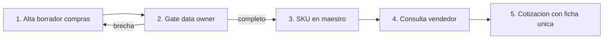

# Lean Canvas — MVP 1

**Proyecto:** ITD · Romantex S.A.C.  
**MVP:** Taxonomía textil + SKU piloto (fuente única de producto)  
**Trazas:** Problema / Segmentos / Solución ← DT Empathize–Prototype (`ref: design-thinking.md`)

## Lienzo

### Tabla 1 — fila superior (5 columnas)

| PROBLEMA | SOLUCIÓN | PROPUESTA DE VALOR ÚNICA | VENTAJA ESPECIAL | SEGMENTO DE CLIENTES |
|----------|----------|--------------------------|------------------|----------------------|
| 1. Catálogo multimarca sin lenguaje común (composición, unidad, nombre) entre showroom, almacén y web. `hipótesis`  2. Cotizar exige cruzar ≥3 fuentes (PDF marca, inventario, web). `hipótesis`  3. Stock vs pedido por catálogo no está anclado a un SKU interno. `hipótesis`  **Alternativas existentes:** fichas PDF / Excel / memoria / OpenCart-cotización; ERP textil local (Kaypi/Odoo) sin taxonomía deco previa. `evidencia` sector + web pública | 1. Maestro ligero (Sheets/Airtable) con taxonomía deco mínima + atributos obligatorios. `ref: DT I1`  2. Convención `sku_interno` + mapeo `codigo_proveedor` (matriz de brechas).  3. Gobernanza: data owner, estados borrador/completo, piloto 30–50 refs. | Para el **asesor de showroom** que **no puede confirmar qué es / composición / unidad sin cruzar tres fuentes**, el **maestro piloto Romantex** es una **ficha única gobernada** que **responde en una sola consulta**, a diferencia de **PDFs de marca + inventario + web sueltos**. `hipótesis` | Ninguna aún a escala plataforma. Diferenciador operativo del piloto: taxonomía **metro/rollo + Contract** (no matriz talla-color Gamarra). `hipótesis` | **Primario:** vendedores/asesores showroom (San Isidro, Surco). `hipótesis`  **Secundarios:** compras/importaciones; asesor Contract; almacén (validación muestra).  **Early adopters:** 1–2 asesores + data owner + compras en 2–3 familias piloto. `pendiente_campo` designación |

### Tabla 2 — fila media (bajo Solución y Ventaja)

| MÉTRICAS CLAVE | CANALES |
|----------------|---------|
| % ítems piloto con atributos obligatorios completos (≥90 %). `criterio_exito` profile  % consultas piloto resueltas con **una** fuente (meta: vendedor no abre 3). `hipótesis` umbral Test  Tiempo a respuesta “qué es / composición / unidad” en cotización piloto. `pendiente_campo` baseline | Interno (N/A cobro): showroom → maestro; compras → alta borrador; data owner → publicación.  Externo: no canal de venta nuevo; web solo lectura futura (MVP 3). `evidencia` exclusión profile |

### Tabla 3 — base del lienzo

| ESTRUCTURA DE COSTOS | FLUJO DE INGRESOS |
|----------------------|-------------------|
| Tiempo data owner + compras (carga 30–50 refs); horas observación Fase 0; herramienta Sheets/Airtable (bajo/cero CAPEX). `hipótesis`  Costo de oportunidad si se fuerza ERP antes de taxonomía (riesgo amplificar basura). `evidencia` sector PIM/MDM | N/A cobro directo del MVP académico.  Valor esperado post-adopción: menos retrabajo en cotización y menos promesas inconsistentes (activo de decisión para Romantex). `hipótesis` / proxy sector |

### Flujo del feature central (maestro piloto)

**Paso a paso:** (1) Compras carga `codigo_proveedor` y campos crudos. (2) Data owner valida obligatorios / taxonomía. (3) Se publica `sku_interno` en el maestro. (4) Vendedor consulta solo el maestro. (5) Cotiza sin PDF + inventario + web en paralelo.
