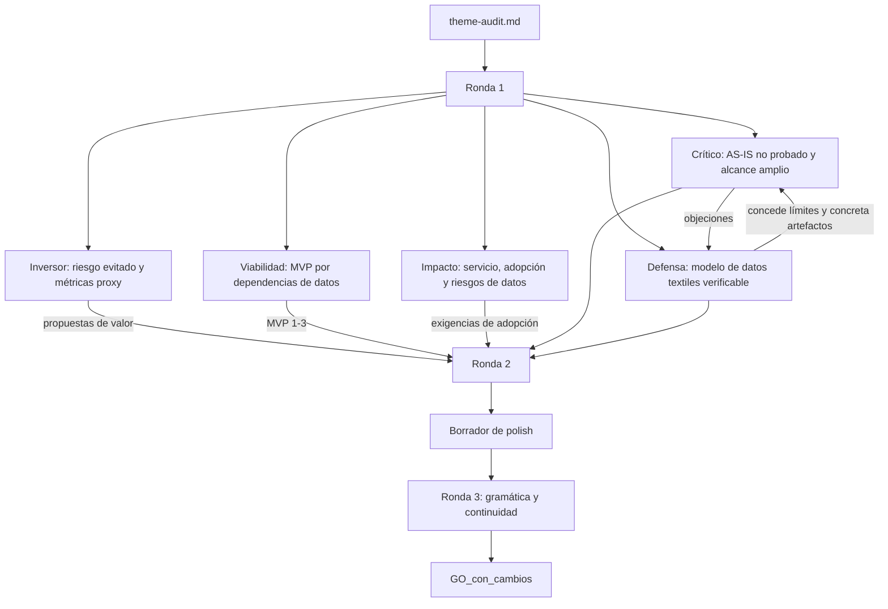

# Debate de auditoría — IRD-2

## CONTEXTO

- dominio: retail de decoración y textiles de interior; importación, showroom y línea Contract
- pais_region: Perú, Lima
- fase_entregable: diagnóstico
- restricciones: empresa real; ficha pública disponible; AS-IS interno no publicado; alcance proporcional a una PYME; sin ERP/WMS enterprise ni omnicanalidad completa
- modo: una_alternativa
- tipo_sujeto: empresa
- sujeto: Romantex S.A.C.

## FICHA_EMPRESA

Romantex S.A.C. es una sociedad anónima cerrada peruana, con RUC 20293975036 e inicio de actividades registrado el 1 de octubre de 1995. Su sitio oficial la presenta como especialista en telas decorativas, revestimientos murales y accesorios importados para uso residencial y comercial. Publica locales en Av. Paz Soldán 185, San Isidro, y Av. El Polo 376, Surco, Lima, además de canales digitales y solicitud de muestras. El directorio público consultado confirma razón social, condición activa, dirección legal y página web. No se encontraron declaraciones formales de misión, visión y valores; se conserva como propuesta observable la especialización, variedad, calidad, servicio a diseñadores y atención de proyectos Contract. La historia pública disponible distingue la trayectoria comercial de cualquier AS-IS operativo: no demuestra cómo se registran hoy los productos, existencias o pedidos.

## BLOQUE_TEMA

**Tema auditado:** Digitalización del inventario y estandarización de atributos y medidas de producto textil en Romantex S.A.C.

**Núcleo:** construir una fuente única de verdad para producto, variante, medida, unidad de venta y disponibilidad, empezando por dos o tres familias textiles priorizadas y dejando la sincronización multicanal como una fase posterior.

**Ángulos retenidos:**

1. PIM ligero y taxonomía textil para consultas de showroom: ancho, composición, color, unidad metro/rollo, aplicación y mantenimiento.
2. Visibilidad de inventario entre almacén, showrooms y canal web, con sincronización periódica y reglas de reserva, no necesariamente tiempo real.
3. Estandarización de SKU y medidas como base para reportes de rotación, reposición y tendencias.

## Ronda 1 — análisis de fondo

### Crítico estricto

- **Ataque 1, evidencia del problema:** la ficha pública confirma el tipo de empresa y sus canales, pero no demuestra desalineación entre inventario físico, catálogo y ventas. El problema operativo debe formularse como hipótesis a validar, no como hecho.
- **Ataque 2, alcance:** catálogo, inventario, showrooms, web, Contract, analítica y roadmap de 12–18 meses pueden producir un informe demasiado amplio para diagnóstico.
- **Ataque 3, aporte:** PIM, SKU y omnicanalidad son prácticas conocidas. El aporte académico no puede ser "digitalizar"; debe ser un modelo de datos y priorización específico para venta consultiva textil, con criterios verificables.
- **Ataque 4, benchmark:** Andover y Pittarello prueban patrones de solución, no que Romantex requiera esas plataformas. El caso Textil Cerna debe usarse con cuidado como referente de procesos, no como prueba del AS-IS de Romantex.
- **Condiciones sin las cuales NO_GO:** no inventar conteos de errores o tiempos; acotar familias y flujo; definir atributos y criterios de calidad; separar diagnóstico de implementación.
- **Preguntas al defensor:** ¿qué artefacto nuevo se entregará además de una recomendación genérica? ¿Qué evidencia mínima permitiría afirmar que una variante está correctamente identificada y disponible?
- **Puntuación:** problema 4/5; alcance 3/5; evidencia_aporte 3/5.
- **Veredicto del agente:** GO_con_cambios. Resiste si el problema se trata como hipótesis de diagnóstico y el MVP arranca por datos maestros.
- **Evidencia:** suficiente para la empresa y los patrones externos; insuficiente para probar el AS-IS interno.

### Defensor con fundamento

- La objeción de evidencia se acepta parcialmente: el informe no afirmará que Romantex carece de integración. Medirá o describirá la brecha mediante muestra de fichas, registros, entrevistas y observación cuando estén disponibles.
- El aporte defendible es un esquema de datos textiles aplicado a la venta consultiva: referencia de proveedor, familia, composición, color, ancho, unidad de venta, aplicación, mantenimiento, ubicación, estado y disponibilidad. El esquema conserva el valor original y la normalización, lo que permite trazabilidad.
- El alcance se ajusta a dos o tres familias y un flujo núcleo: recepción o alta de producto → consulta de disponibilidad → cotización/pedido. La integración completa con todos los canales queda como recomendación futura.
- Andover aporta un caso textil de integración de inventario, catálogo y comercio B2B; Pittarello aporta un caso de visibilidad distribuida. Ambos son patrones, no evidencia de necesidades internas de Romantex.
- **Hueco honesto:** sin una muestra interna no se puede cuantificar el beneficio ni seleccionar la herramienta definitiva.
- **Pregunta al crítico:** ¿aceptas como aporte verificable un diccionario de datos, reglas de calidad, modelo SKU y matriz de brechas, aunque no se implemente software?
- **Puntuación:** problema 4/5; alcance 4/5; evidencia_aporte 4/5.
- **Evidencia:** suficiente con límites explícitos.

### Impacto social

- **Beneficiarios directos:** asesores de showroom, personal de almacén, equipo Contract, diseñadores y clientes residenciales que necesitan conocer producto, medida y disponibilidad.
- **Status quo:** se mantienen consultas repetidas, posibles respuestas inconsistentes, reprocesos y dificultad para distinguir existencias disponibles, reservadas o ubicadas en otro punto. No se afirma que todos estos efectos ocurran hoy; son riesgos a comprobar.
- **Impacto del entregable actual:** moderado y local. Un diagnóstico bien delimitado puede reducir ambigüedad organizativa y dejar reglas reutilizables, pero no genera por sí solo ahorros o inclusión.
- **Impacto potencial si se escala:** una fuente común podría mejorar la confiabilidad de cotizaciones, reducir ventas de stock no disponible y facilitar la atención de proyectos; es una proyección, no un resultado observado.
- **Riesgos del dominio:** bajos. Los riesgos reales son exclusión de personal con baja alfabetización digital, dependencia de un proveedor, exposición innecesaria de datos comerciales y uso de reglas de tallas o medidas sin validación. Se mitigan con capacitación, roles, exportabilidad y revisión humana.
- **Exigencias:** incluir responsables de actualización, historial de cambios, reglas de acceso y un criterio de conciliación físico-digital.
- **Puntuación:** problema 4/5; alcance 4/5; evidencia_aporte 3/5; manejabilidad/MVP 4/5; camino_valor 3/5.
- **Veredicto:** relevancia social media-alta para la fase diagnóstico; el valor es organizativo y de servicio, no una promesa de impacto social amplio.

### Viabilidad MVP

- **Alcance anclado a:** crítico y defensor.
- **Demanda / utilidad práctica:** alta.
- **Manejabilidad:** parcial al alcance original; sí después de separar datos maestros, visibilidad y analítica en secuencia.
- **Criterio de secuenciación:** dependencias_datos. Sin atributos y códigos consistentes, la visibilidad de stock y los reportes no son confiables.

#### MVP 1 — diagnóstico y modelo maestro de producto (arranque)

- objetivo: establecer una base verificable para identificar productos y variantes textiles.
- entregables: muestra de 2–3 familias; mapa AS-IS; diccionario de datos; taxonomía; plantilla de ficha; propuesta de SKU; matriz de calidad y responsables.
- criterio_exito: cada registro de la muestra puede asociarse a una familia, referencia, atributos obligatorios, unidad de venta y estado de validación; las excepciones quedan documentadas.
- dependencias: acceso a una muestra de catálogo y a responsables de comercial/almacén; si no hay acceso, declarar hipótesis y límites.
- fuera_de_este_mvp: integración técnica, migración masiva, RFID y pronóstico.

#### MVP 2 — consulta de disponibilidad por ubicación

- objetivo: diseñar el flujo mínimo para consultar stock de almacén y showrooms.
- entregables: modelo de estados disponible/reservado/no disponible; mapa de movimientos; reglas de actualización y reserva; prototipo de consulta o especificación funcional; indicadores de conciliación.
- criterio_exito: un usuario puede responder qué variante consultar, en qué unidad, dónde se encuentra y con qué fecha de actualización, o identificar explícitamente el dato faltante.
- dependencias: MVP 1 validado y muestra de movimientos o conteos.
- fuera_de_este_mvp: tiempo real obligatorio y conexión con todos los canales.

#### MVP 3 — indicadores comerciales y roadmap

- objetivo: convertir datos normalizados en decisiones básicas de reposición y priorización.
- entregables: indicadores de rotación, quiebres, stock inmovilizado y completitud; backlog priorizado; roadmap TO-BE y opciones de herramientas.
- criterio_exito: cada indicador tiene definición, fuente, periodicidad, responsable y limitación documentada.
- dependencias: datos históricos consistentes y MVP 2 operativo o simulado con muestra.
- fuera_de_este_mvp: inteligencia artificial, optimización automática y evaluación financiera definitiva.

- **Por qué empezar por MVP 1:** es el único que puede falsar rápidamente si el problema central está en la calidad y estructura del dato; además reduce el riesgo de diseñar una integración sobre códigos o medidas ambiguos.
- **Exigencia al tema final:** presentar MVP 1 como entregable actual y MVP 2–3 como secuencia posterior, no como compromiso simultáneo.
- **Puntuación:** manejabilidad 4/5; claridad_mvp1 5/5; ajuste_restricciones 4/5.
- **Veredicto:** GO_con_cambios.

### Inversor

- **Beneficiario de valor:** Romantex, sus equipos comerciales y de almacén, y los clientes de proyectos que dependen de cotizaciones confiables.
- **Camino a beneficio:** parcial pero plausible. El diagnóstico no es todavía una inversión ni demuestra ROI; crea condiciones para ahorro de tiempo, menor riesgo de prometer stock incorrecto y mejor reposición.
- **Tesis de valor:** ordenar el dato de producto antes de comprar una integración reduce el riesgo de automatizar inconsistencias y puede convertir una mejora operativa pequeña en capacidad comercial repetible.
- **Propuestas de valor:**
  1. ahorro operativo: medir tiempo de búsqueda y correcciones antes/después del modelo maestro; horizonte de validación en el diagnóstico y piloto posterior.
  2. riesgo evitado: medir discrepancias entre muestra física, registro y publicación; horizonte de una conciliación periódica.
  3. adopción comercial: medir completitud de fichas y porcentaje de consultas respondidas con una fuente común; horizonte del piloto con asesores.
- **Qué no es inversión aún:** no hay datos de ventas, costos, margen, volumen de consultas ni sponsor presupuestal; no se deben inventar ahorros ni retorno.
- **Exigencias:** incluir una métrica base, un responsable de captura y una decisión de continuidad para cada MVP.
- **Puntuación:** retorno 3/5; camino_valor 4/5; credibilidad_beneficios 3/5.
- **Veredicto:** GO_con_cambios; soft-veto superado si la tesis se expresa como reducción de riesgo y habilitación comercial, no como ROI demostrado.

## Ronda 2 — cruce y resolución

### Respuesta a ataques del crítico

- Se acepta que el AS-IS es una hipótesis. La redacción final usará "diagnosticar", "validar" y "medir" para los procesos internos; solo la identidad, oferta, ubicaciones y trayectoria se presentan como hechos públicos.
- Se elimina la pretensión de resolver simultáneamente todo el omnicanal. El entregable actual será MVP 1; MVP 2 y MVP 3 quedan como secuencia.
- El aporte se concreta en cuatro artefactos: diccionario de datos, taxonomía textil, esquema de SKU y matriz de calidad/responsabilidades.

### Respuesta a propuestas de valor del inversor

- El beneficio se formula con métricas proxy: tiempo de búsqueda, completitud de ficha, discrepancias de inventario y consultas resueltas con fuente común.
- No se afirma retorno financiero hasta obtener línea base. La primera decisión de inversión es si el dato tiene suficiente calidad para justificar un piloto de disponibilidad.

### Decisión del orquestador

- **MVP de arranque:** MVP 1, diagnóstico y modelo maestro de producto.
- **Razón:** depende menos de una plataforma específica, permite verificar el problema con una muestra pequeña y habilita los dos MVP posteriores.
- **Veredicto consolidado:** GO_con_cambios.
- **Ataques fuertes abiertos:** ninguno que obligue a cambiar el núcleo; permanecen como riesgos controlables la falta de AS-IS publicado y la necesidad de acceso a una muestra interna.

## Puntuación (dimensiones)

| Dimensión / eje       |   Crítico |   Defensa |   Impacto | Viabilidad |  Inversor | Notas                                                       |
| --------------------- | --------: | --------: | --------: | ---------: | --------: | ----------------------------------------------------------- |
| problema              |         4 |         4 |         4 |          4 |         3 | Problema plausible; debe validarse internamente.            |
| alcance               |         3 |         4 |         4 |          4 |         3 | Viable después de secuenciar los MVP.                       |
| evidencia_aporte      |         3 |         4 |         3 |          4 |         3 | Fuentes públicas sostienen contexto y patrones, no AS-IS.   |
| manejabilidad / MVP   |         3 |         4 |         4 |          5 |         4 | MVP 1 es concreto y dependencias explícitas.                |
| camino_valor          |         3 |         4 |         3 |          4 |         4 | Valor inicial como riesgo evitado y habilitación comercial. |
| **Total / veredicto** | **16/25** | **20/25** | **18/25** |  **21/25** | **17/25** | **GO_con_cambios**                                          |

## Cruce global

El tema no necesita cambiar de núcleo, pero sí de promesa: no se evaluará una transformación digital total ni se afirmará una falla operativa sin evidencia interna. El producto académico será un diseño de datos y proceso que permita decidir si una futura sincronización de inventario merece inversión. La especificidad está en el catálogo textil multimarca y en la venta consultiva residencial/Contract, no en inventar una tecnología propietaria.

### Debate MVP entregables

- [viabilidad-mvp] propone comenzar por diccionario, taxonomía, SKU y matriz de calidad; la secuencia se justifica por dependencias de datos.
- [crítico-estricto] acepta el MVP si no se presenta como implementación de PIM ni como prueba de stock en tiempo real.
- [defensor-fundamento] considera que los cuatro artefactos constituyen aporte verificable y replicable en una muestra.
- [impacto-social] exige responsables, capacitación, historial de cambios y reglas de acceso.
- [inversor] prioriza métricas proxy y una decisión de continuidad antes de justificar gasto de plataforma.
- **Orquestador — MVP de arranque:** MVP 1 — diagnóstico y modelo maestro de producto.

## Calidad de prosa (R3)

- [gramatica-continuidad] diagnóstico: la versión final debe reemplazar formulaciones categóricas sobre fallas internas por lenguaje de diagnóstico; mantener separados los hechos públicos de las hipótesis operativas; evitar repetir "fuente única de verdad" sin explicar el artefacto que la materializa.
- Reescrituras aplicadas en el polish: descripción en prosa continua, problema con evidencia y límites, alcance con MVP 1 como trabajo actual y MVP 2–3 como secuencia.
- Checklist: misma voz académica; párrafos enlazados; sin etiquetas de pipeline en el texto final; nombres de empresa, casos y fuentes conservados.

## Diagrama del debate

## Fuentes consultadas

- Romantex, Empresa: https://www.romantex.com.pe/empresa
- Romantex, sitio y locales: https://www.romantex.com.pe/
- UniversidadPeru, ficha pública de Romantex S.A.C.: https://www.universidadperu.com/empresas/romantex.php
- LinkedIn, Romantex S.A.C.: https://linkedin.com/company/romantex-sac
- Acumatica, caso Andover Fabrics: https://www.acumatica.com/success-stories/andover-fabrics/
- OneStock, caso Pittarello: https://www.onestock-retail.com/customer-story/omnichannel-oms-for-fashion-retail-pittarello/
- Global Textile Scheme, estándar de intercambio de datos textiles: https://www.globaltextilescheme.org/gts-standard/
- Textil Cerna SAC, repositorio USIL: https://hdl.handle.net/20.500.14005/16335
