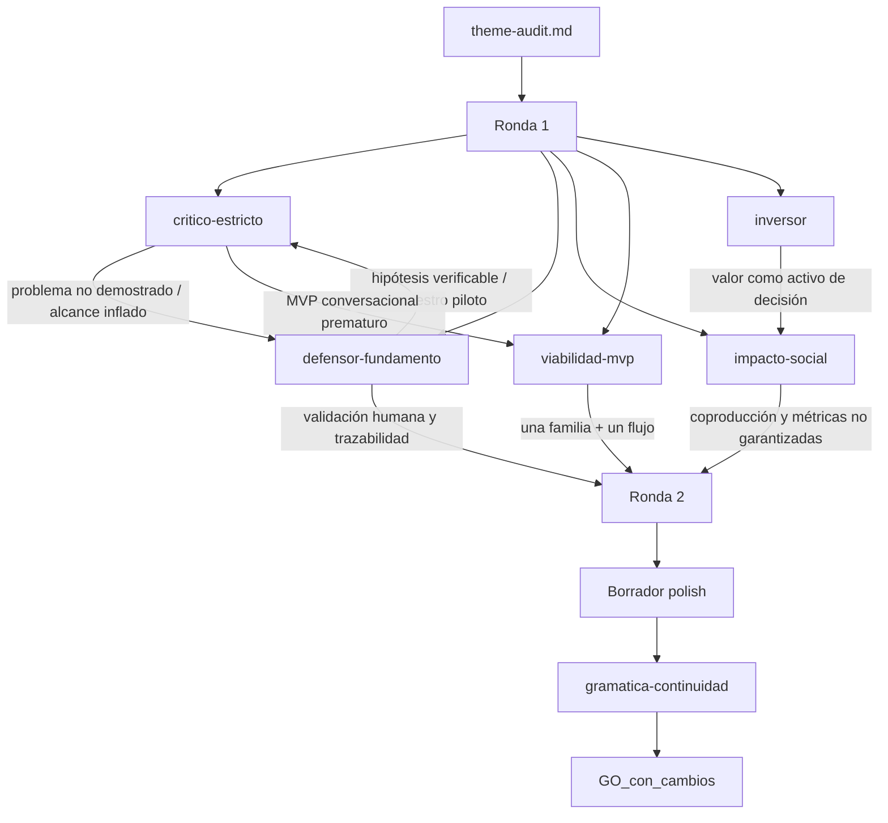

# Debate de auditoría — ITD-V2

## Puntuación (dimensiones)

| Dimensión / eje | Crítico | Defensa | Impacto | Viabilidad | Inversor | Notas |
|-----------------|---------|---------|---------|------------|----------|-------|
| problema | 3 | 4 | 3 | 4 | 3 | Problema plausible, pero aún hipótesis; exige evidencia primaria de Romantex. |
| alcance | 4 | 4 | 4 | 5 | 4 | Defendible al limitarlo a una familia, un flujo y diseño condicionado. |
| evidencia/aporte | 3 | 3 | 2 | 3 | 3 | Ficha pública y benchmarks suficientes para contexto; falta AS-IS interno. |
| manejabilidad / MVP | 4 | 4 | 4 | 5 | 4 | MVP 1 controlable; el asistente queda condicionado y no productivo. |
| camino_valor | 3 | 4 | 3 | 4 | 3 | Valor como activo de decisión; ROI futuro no demostrado. |
| **Total / veredicto** | **GO_con_cambios** | **GO_con_cambios** | **GO_con_cambios** | **GO_con_cambios** | **GO_con_cambios** | **Pasa con recorte estricto y validación primaria.** |

## Preguntas y respuestas (cronológico)

- **[critico-estricto]** La evidencia pública confirma la oferta y los locales, pero no demuestra inconsistencias, retrabajo, errores de stock ni demoras internas.
  - **[defensor-fundamento]** Concedido. La brecha se formula como hipótesis verificable. Se exigirán entrevistas, observación, comparación de fuentes y muestras trazables de una familia antes de afirmar el problema.
  - **[impacto-social]** El diagnóstico no debe prometer mejoras sociales o comerciales; su impacto inicial es habilitador: hace visibles datos faltantes, responsabilidades y riesgos de automatizar prematuramente.

- **[critico-estricto]** El tema agrupa gobierno de datos, inventario, asistente y pedidos, con riesgo de convertirse en tres proyectos.
  - **[viabilidad-mvp]** Se reduce a una familia y un flujo: consulta o comparación → disponibilidad informada → solicitud preliminar → validación por asesor. El MVP 1 es diagnóstico y modelo mínimo de datos; el asistente queda condicionado.
  - **[defensor-fundamento]** El asistente deja de ser un proyecto independiente y se convierte en una posible interfaz posterior sobre datos validados.

- **[critico-estricto]** “Fuente única de verdad” promete una autoridad organizacional que no puede asumirse.
  - **[defensor-fundamento]** Se sustituye por “modelo mínimo gobernado” o “maestro piloto”: cada atributo debe tener fuente, responsable, fecha o estado de actualización y tratamiento de conflictos. No se promete reemplazar todos los sistemas.

- **[critico-estricto]** La recomendación textil es subjetiva y el pedido preliminar sigue requiriendo unidad, variante, cantidad, precio y condiciones.
  - **[defensor-fundamento]** El piloto prioriza búsqueda y comparación explicables con atributos documentados. Las decisiones estéticas, técnicas, Contract, de precio y de confirmación permanecen humanas.
  - **[viabilidad-mvp]** La maqueta conversacional solo se construirá con datos reales anonimizados o de prueba y deberá derivar toda ambigüedad, conflicto o falta de autorización.

- **[inversor]** Existe camino de valor, pero el informe y una futura implementación deben separarse.
  - **[impacto-social]** Ahorro de tiempo, riesgo comercial evitado y solicitudes completas son hipótesis medibles, no resultados. Deben evaluarse sin vigilancia individual y con participación de vendedores y almacén.
  - **[inversor]** El valor del informe consiste en reducir incertidumbre y decidir si merece la pena invertir en fases posteriores. No se puede afirmar ROI, ventas incrementales o payback.

- **[critico-estricto, R2]** El MVP 3 conversacional puede ser paperware y el MVP 4 duplica el protocolo metodológico.
  - **[viabilidad-mvp]** Se conserva el asistente como MVP 2 condicionado, limitado a maqueta o especificación; la prueba operativa queda como MVP 3 opcional. El protocolo, criterios y roadmap forman parte del MVP 1.
  - **[inversor]** El arranque debe ser el maestro mínimo y la gobernanza; sin ellos el chatbot automatizaría respuestas inconsistentes.
  - **[impacto-social]** La coproducción con vendedores y almacén es condición de adopción y de preservación del conocimiento tácito.

## Cruce global

El panel converge en **GO_con_cambios**. El tema es defendible como diagnóstico aplicado y diseño condicionado, no como implementación de un asistente ni como prueba de que Romantex ya sufre un problema cuantificado. La empresa y su propuesta pública están suficientemente documentadas; el AS-IS de inventario, catálogo, consultas y pedidos sigue abierto.

El recorte decisivo es convertir el asistente en una fase dependiente de un único MVP de arranque: diagnóstico y modelo mínimo gobernado para una familia piloto. La unidad de análisis será el flujo de consulta y preparación de solicitud, no la transformación digital completa de la organización. La investigación deberá diferenciar hechos observados, hipótesis y decisiones de diseño.

El aporte defendible no es crear otro chatbot. Consiste en relacionar atributos de producto, disponibilidad trazable, reglas de respuesta y validación humana en una operación textil consultiva. La recomendación estética automatizada, la confirmación de pedidos y la promesa de tiempo real quedan fuera.

## Debate MVP entregables

- **[viabilidad-mvp] Propuesta de secuencia:**  
  - **MVP 1 — Diagnóstico y modelo mínimo de datos para una familia piloto:** mapa AS-IS, selección de familia, muestra trazable, diccionario, matriz fuente–campo–responsable, reglas de conflicto, modelo TO-BE mínimo, protocolo y roadmap condicionado.
  - **MVP 2 — Maqueta conversacional condicionada:** búsqueda, comparación y preparación de solicitud sobre los datos validados, con fuente, fecha, advertencia y derivación humana.
  - **MVP 3 — Prueba controlada opcional:** escenarios con usuarios internos y decisión de continuar, ajustar o detener.

- **[critico-estricto]** MVP 1 es el núcleo correcto. El modelo TO-BE mínimo debe integrarse allí; el protocolo y el roadmap no deben presentarse como MVP separado. Si el asistente se presenta como resultado productivo, el alcance vuelve a inflarse.

- **[defensor-fundamento]** MVP 1 funciona como puerta de decisión: si no hay fuente, responsable o atributos suficientemente completos, el resultado válido es un diagnóstico de preparación de datos, no un chatbot. El aporte es metodológico y de diseño aplicado.

- **[impacto-social]** Vendedores y almacén deben coproducir atributos, unidades, estados de disponibilidad y excepciones. Deben protegerse datos personales y evitar que los registros de conversación se conviertan en vigilancia individual.

- **[inversor]** El valor del informe es un activo de decisión. La futura implementación podría reducir búsquedas, solicitudes incompletas y riesgo de comunicar disponibilidad incorrecta, pero solo después de línea base, piloto y adopción. No hay base para ROI.

- **Orquestador — MVP de arranque:** **MVP 1 — Diagnóstico y modelo mínimo gobernado para una familia piloto**, porque permite verificar el problema y la preparación de datos antes de diseñar la interfaz conversacional.

## Calidad de prosa (R3)

- **[gramatica-continuidad]** Se reformularon tema, descripción, problema y alcance para separar la hipótesis interna de la evidencia pública, reemplazar la promesa de “fuente única” por un modelo mínimo gobernado y distinguir solicitud preliminar de pedido confirmado.
- Se mantuvieron como condiciones explícitas la validación primaria, la participación de vendedores y almacén, la trazabilidad de atributos y la derivación humana.
- Se eliminó la apariencia de que el asistente constituye una implementación productiva o el resultado principal del informe.

## Diagrama del debate

## Fuentes consultadas

- Romantex — Empresa: https://www.romantex.com.pe/empresa
- Romantex — Company: https://www.romantex.com.pe/company
- Romantex — Inicio: https://romantex.com.pe/
- Romantex — Contacto: https://www.romantex.com.pe/contacto
- UniversidadPeru — Romantex S.A.C.: https://www.universidadperu.com/empresas/romantex.php
- Ubicania — Romantex S.A.C.: https://ubicania.com/empresas/romantex-s-a-c_id_143809909583B417
- Dossier de Arquitectura — nuevo showroom: https://dossierdearquitectura.com/romantex-nos-presenta-su-nuevo-showroom/
- Ellas Internacional — renovación y liderazgo: https://www.ellasinternacional.com/romantex-renueva-su-esencia-diseno-vanguardia-y-vision-innovadora-al-frente-del-sector-deco-en-peru/
- BigCommerce — Andover Fabrics: https://www.bigcommerce.com/case-study/andover-fabrics/
- Stock2Shop — Aranda Textiles: https://www.stock2shop.com/case-studies/aranda/
- Salesforce — West Marine: https://www.salesforce.com/blog/west-marine-customer-story/
- Bow Chat — AI ordering case: https://bow.chat/customers/ai-ordering-food-distribution
- OECD — Digital Transformation of SMEs: https://www.oecd.org/en/publications/the-digital-transformation-of-smes_bdb9256a-en.html
- OECD — Generative AI and the SME Workforce: https://www.oecd.org/en/publications/generative-ai-and-the-sme-workforce_2d08b99d-en.html
- Ley peruana de protección de datos personales: https://www.gob.pe/institucion/congreso-de-la-republica/normas-legales/243470-29733
