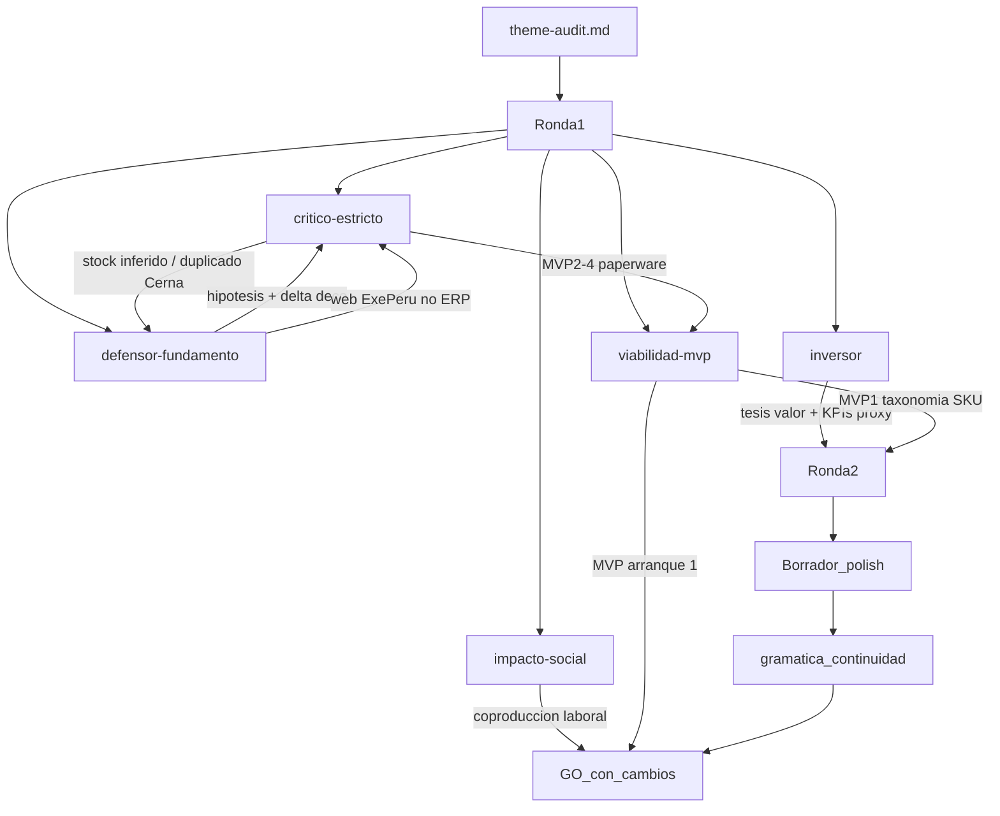

# Debate de auditoría — ITD

## Puntuación (dimensiones)

| Dimensión / eje | Critico | Defensa | Impacto | Viabilidad | Inversor | Notas |
|-----------------|---------|---------|---------|------------|----------|-------|
| problema | 3 | 4 | 3 | — | — | Plausible; matizar «tiempo real» → disponibilidad consultiva stock vs catálogo |
| alcance | 3 | 4 | — | 4 | — | Diagnóstico acotado; MVPs 2–4 condicionados post-piloto |
| evidencia_aporte | 2 | 3 | 2 | — | 3 | Empresa sólida; diferenciación vs Cerna exige taxonomía deco explícita |
| manejabilidad / MVP | 4→2 (cadena) | — | — | 5 (MVP1) | — | MVP 1 defendible; cola 2–4 = recomendaciones TO-BE, no paperware |
| camino_valor | 3 | — | 3 (pot.) | — | 4 | Retorno depende de ejecutar TO-BE; informe = activo de decisión |
| Total / veredicto | GO_con_cambios | APTO | Media | Viable | GO_con_cambios | **GO_con_cambios** |

## Preguntas y respuestas (cronológico)

- [critico-estricto] El dolor operativo (stock no confiable, cotizaciones inconsistentes) está inferido, no demostrado; la web ya separa «productos en stock» vs «por catálogo» y cotiza en línea.
  - [defensor-fundamento] Correcto: la web no prueba niveles de stock, pero sí arquitectura de canales desalineada (OpenCart/cotización sin cantidades, doble frente web, claim comercial vs dato verificable). El problema se reformula como confirmación oportuna de disponibilidad en flujo consultivo multicanal — hipótesis a validar en entrevistas.

- [critico-estricto] Riesgo de duplicar tesis Cerna 2024 (Gamarra, SKU talla-color, SKM multitienda).
  - [defensor-fundamento] Cerna documenta **implementación** en confección; Romantex propone **diagnóstico + TO-BE** en deco importada: metro/rollo, multimarca, Contract, showrooms premium. El aporte académico exige taxonomía deco-peruana explícita y matriz de diferenciación en el informe.

- [critico-estricto] AS-IS sobre rollos multimarca sin acceso interno; roadmap 12–18 meses mezcla diagnóstico con plan IT.
  - [viabilidad-mvp] AS-IS con supuestos validables + entrevistas; roadmap de implementación **condicionado** a hallazgos. Entregable académico = diagnóstico + TO-BE + secuencia MVP, no despliegue.

- [impacto-social] Fase diagnóstico tiene impacto social directo bajo (~1/5); potencial moderado (~3/5) si MVP posterior incluye voz de vendedores/almacén y métricas de confiabilidad.
  - Exigencia: coproducción taxonomía con personal operativo; no prometer stock «tiempo real» sin sync robusta.

- [inversor] Camino de valor parcial pero creíble: captura ventas evitadas, ahorro operativo, multicanal reputacional. Separar valor del informe vs valor de implementación.
  - [defensor-fundamento] Informe habilita piloto taxonomía+SKU y business case mínimo; no recomienda compra ERP enterprise.

- [critico-estricto R2] MVPs 2–4 son paperware sin AS-IS; MVP 3 mal planteado (web ya existe ~625 ítems); falta data owner en MVP 1.
  - [viabilidad-mvp] Aceptado: MVP 3 reformulado como «alinear atributos/stock al catálogo existente»; MVPs 2–4 como fases **condicionadas** post-piloto; MVP 1 incluye rol responsable de datos y criterio de selección de familias/refs.

## Cruce global

El panel converge en **GO_con_cambios**: empresa real verificable, problema estructuralmente plausible en importador-showroom deco, alcance acotado a diagnóstico PYME. Los flancos abiertos — magnitud del dolor sin entrevistas, riesgo de repetir patrón Cerna, cadena MVP inflada — se mitigan reformulando el problema (disponibilidad consultiva, no tiempo real), explicitando delta deco/Contract vs confección Gamarra, y anclando el arranque en **MVP 1 taxonomía + SKU piloto** con data owner y AS-IS documentado.

El inversor no ejerce soft-veto: el camino de valor es defendible con proxies sectoriales (Cerna Lima, Andover atributos textil) si el polish cuantifica hipótesis con KPIs falsables.

### Debate MVP entregables

- [viabilidad-mvp] Secuencia por dependencias_datos: **MVP 1** taxonomía + maestro + 30–50 refs piloto → **MVP 2** visibilidad multisede periódica → **MVP 3** alineación catálogo web existente → **MVP 4** analítica básica (opcional).
- [critico-estricto] MVP 1 correcto como arranque; MVPs 2–4 recortar a recomendaciones condicionadas; MVP 3 renombrar (no «puente greenfield»); incluir dueño de datos y 1 flujo medido (consulta → confirmación stock).
- [defensor-fundamento] MVP 1 responde objeción Cerna: gobernanza del lenguaje del producto **antes** de integrar; decisión empresarial realista = autorizar piloto en 1–2 familias.
- [impacto-social] MVP 1 debe validarse con vendedores y almacén; beneficio social operativo en ~17 trabajadores y diseñadores B2B si reduce retrabajo en cotizaciones.
- [inversor] Valor vendible = showroom conectado simplificado + taxonomía Contract; payback proxy 12–18 meses post-implementación; informe separado de ROI operativo.
- **Orquestador — MVP de arranque:** **MVP 1** — Taxonomía textil + SKU piloto (30–50 referencias, 2–3 familias, data owner, reglas gobernanza) porque sin fuente única de atributos cualquier sync multicanal reproduce el caos.

## Calidad de prosa (R3)

- [gramatica-continuidad] Reescritura de Tema, Descripción, Problema, Alcance y Tesis de valor: conectores explícitos, alcance en prosa continua, hipótesis verificable enfatizada, eliminación de repeticiones «tiempo real». Veredicto, scores y PICOCT sin alteración.

## Diagrama del debate

## Fuentes consultadas

- Romantex — empresa, catálogo, shop: https://www.romantex.com.pe/
- Andover Fabrics / Acumatica: https://www.acumatica.com/success-stories/andover-fabrics/
- Textil Cerna SAC — tesis USIL 2024: https://hdl.handle.net/20.500.14005/16335
- Fabric Sense / Infintrix: https://infintrixtech.com/case-studies/fabric-sense-curtain-order-management
- Global Textile Scheme: https://www.globaltextilescheme.org/
- Kaypi ERP textil / Invy decoración (saturación local): kaypi.pe, invyperu.com
